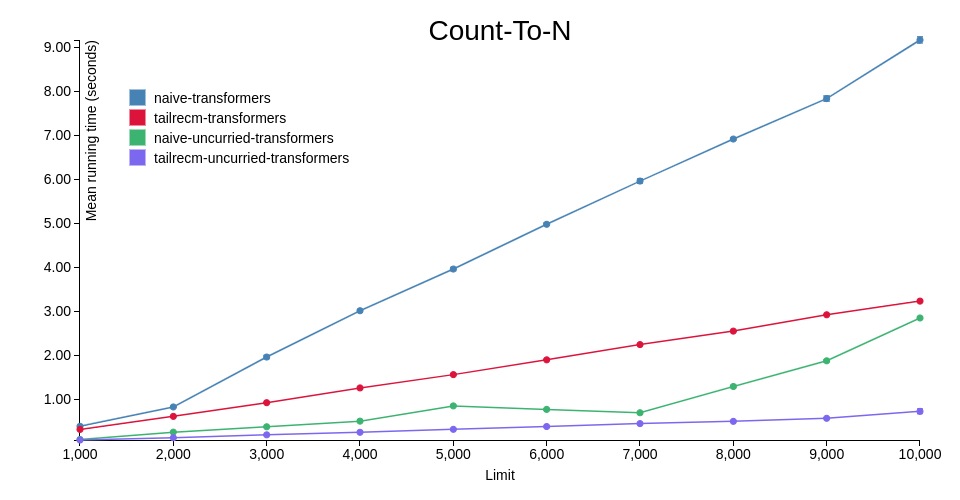

# purescript-uncurried-transformers
Stack-safe monad transformers implemented using continuation-passing style and uncurried functions.

## Installation
```
spago install uncurried-transformers
```

## Vs. Transformers

### At the Surface Level

At the surface-level, the only significant difference between this library and `transformers` is that runner functions like `runStateT`, `runReaderT` accept the monadic actions as their last arguments. Unlike in Haskell where the record accessor dictates that it should be first, we have no such restriction in PureScript, hence, the decision to use more convenient and composable syntax.

### How and Why It Goes Fast

`uncurried-transformers`, as the name and description implies, is implemented using uncurried functions and continuation-passing style. The core type, `RWSET`, is implemented as a newtype over `Fn6` with a bunch of seemingly magical parameters:

```purescript
newtype RWSET r w s e m a = RWSET
  ( forall c
     . Fn6
         -- Environment
         r
         -- State
         s
         -- Trampoline
         ((Unit -> c) -> c)
         -- Lift
         (m (Unit -> c) -> c)
         -- Error
         (Fn3 s e w c)
         -- Success
         (Fn3 s a w c)
         -- Continuation
         c
  )
```

In essence, this is a JavaScript function with 6 (uncurried) arguments, the first two being the `Reader` environment and the `State` state, and the following four being special callbacks which help produce some opaque `c` type, which is
also used as the return type for our uncurried function. What `c` represents doesn't matter right now, but it's important to look out how these callbacks may be used. Let's take a look at some instances for `RWSET`:

The `Applicative` instance, for example, runs the success continuation `done` in order to produce a `c` to be returned; it's passed the current `state`, a result `a` for the monadic action, and a `mempty` result for the writer.

```purescript
instance Monoid w => Applicative (RWSET r w s e m) where
  pure a = RWSET
    ( mkFn6 \_ state _ _ _ done ->
        runFn3 done state a mempty
    )
```

On the other hand, the `MonadThrow` instance runs the failure continuation `error`, in order to produce a `c` to be returned; it's passed the current `state`, an error `e` for the monadic action, and a `mempty` result for the writer.

```purescript
instance Monoid w => MonadThrow e (RWSET r w s e m) where
  throwError e = RWSET
    ( mkFn6 \_ state _ _ error _ ->
        runFn3 error state e mempty
    )
```

The `Functor` instance demonstrates a basic use of the trampoline continuation `more`; what it essentially does is that it "thunks" a result `c` such that some stack space is freed before it's evaluated, effectively making it lazy. In order to `map` an `f` over `RWSET`, we have to run `k` with a custom `done` callback such that `f` is applied over the result `a`. As a rule of thumb, we use `more` liberally in order to preserve the stack-safety of our program.

```purescript
instance Functor (RWSET r w s e m) where
  map f (RWSET k) = RWSET
    ( mkFn6 \environment state0 more lift' error done ->
        more \_ -> runFn6 k environment state0 more lift' error
          ( mkFn3 \state1 a w ->
              more \_ -> runFn3 done state1 (f a) w
          )
    )
```

Last but not least, the `lift` continuation acts as a thunk over the base monad `m`, much like `more` acts as a thunk for non-monadic values. For `MonadTrans`, we effectively take the `m a` and turn it into `m (Unit -> c)`, before being passed to `lift` for the final `c` value.

```purescript
instance Monoid w => MonadTrans (RWSET r w s e) where
  lift m = RWSET
    ( mkFn6 \_ state _ lift' _ done ->
        lift' (map (\a _ -> runFn3 done state a mempty) m)
    )
```

Hold on, if the `c` type is completely opaque, then how are we supposed to run the `RWSET` monad? The answer lies in the fact that we can reify `c` into "any" type that we want, but for this library in particular, we choose to reify the continuations in the form of an ADT. Notice how each variant of the following type corresponds to the continuations in `RWSET`, except each `c` is replaced with a concrete type. Similarly, we can just encode the failure and success continuations using an `Either`!

```purescript
data RunRWSET r w s e m a
  = More (Unit -> RunRWSET r w s e m a)
  | Lift (m (Unit -> RunRWSET r w s e m a))
  | Stop s (Either e a) w
```

Using an ADT allows us to write a tail-recursive loop that "interprets" the `RWSET` monad, as shown in the code block below. Focusing first on the latter half, we can see that the uncurried function `k` is ran with the environment `r`, the state `s`, the `More` constructor as the trampoline, the `Lift` constructor as the lift, and `Stop` to encode `Either` an error `e` or a result `a`, along with the final state `s` and the writer result `w`.

```purescript
runRWSET r s (RWSET k) =
  let
    go step = case step unit of
      More n ->
        go n
      Lift m ->
        Loop <$> m
      Stop s' a w ->
        pure $ Done $ s' /\ a /\ w
  in
    tailRecM go \_ ->
      runFn6 k r s More Lift
        (mkFn3 \s' e w -> Stop s' (Left e) w)
        (mkFn3 \s' a w -> Stop s' (Right a) w)
```

We then analyze its result using the auxiliary function `go`. If the result of running `k` is `More`, we tail-recurse into `go` with the thunk `n`; if the result is `Lift`, we tail-recurse into `go` (with the help of `tailRecM`) such that the monadic action is ran before the thunk is evaluated; if the result is `Stop`, we just signal to `tailRecM` that we're done computing and we have our final result. This tail-recursive loop is what allows us to keep stack-safety at the cost of some heap allocations. 

### (Real-World) Benchmarks

See the benchmark code [here](./bench/Main.purs). For `transformers`, the `RWST` type with a `Trampoline` base is used, while for `uncurried-transformers`, the equivalent `RWSET` type is used with `Identity` as its base. In the following graphs, `naive-` means recursion is performed naively i.e. without the help of `tailRecM`; its presence corresponds to the `tailrecm` prefix instead.


